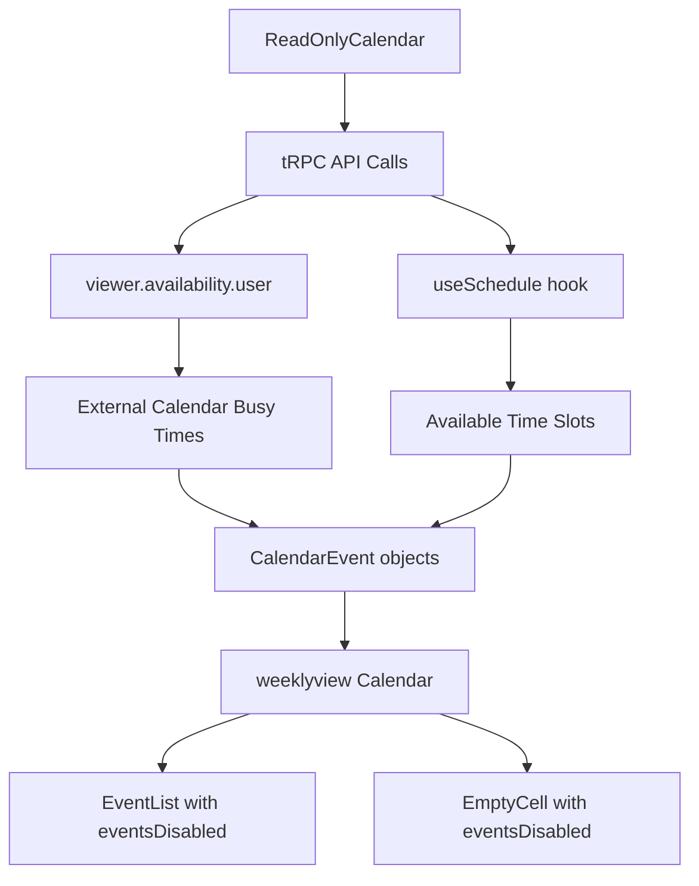

# Read-Only Calendar View

## Overview

The Read-Only Calendar View provides a way for users to view their calendar events and availability without being able to edit or interact with the calendar directly. This feature is built on top of Cal.com's existing `weeklyview` component architecture and supports both standalone usage and embedded scenarios.

## Features

- **Read-only display** of calendar events and busy times
- **External calendar integration** showing events from Google, Outlook, Apple, etc.
- **Availability visualization** with optional time slot display
- **Customizable time ranges** and view types (week/day)
- **Platform atom support** for embedding in external applications
- **Color-coded events** based on source calendar
- **Responsive design** with mobile-not-supported fallback

## Architecture

The read-only calendar is implemented using several key components:

### Core Components

1. **`ReadOnlyCalendar`** - Main wrapper component that fetches data and renders the calendar
2. **`Calendar` (weeklyview)** - Base calendar component with `eventsDisabled` functionality
3. **`CalendarView` (Platform Atom)** - Embeddable version with navigation controls
4. **Page route** - Standalone web application page

### Data Flow



### Read-Only Implementation

The read-only functionality is achieved through:

1. **`eventsDisabled` prop** - Disables all event interactions in `EventList` and `EmptyCell` components
2. **`hoverEventDuration={0}`** - Removes hover affordances for empty cells
3. **No `onEmptyCellClick` handler** - Prevents time slot selection
4. **Optional `onEventClick` removal** - Disables event click handling

## Usage

### Basic Usage

```typescript
import { ReadOnlyCalendar } from "@calcom/features/calendars/ReadOnlyCalendar";

function MyCalendarView() {
  return (
    <ReadOnlyCalendar
      username="john-doe"
      showExternalCalendars={true}
      showAvailability={false}
      startHour={9}
      endHour={17}
    />
  );
}
```

### Platform Atom Usage (Embeddable)

```typescript
import { CalendarView } from "@calcom/platform/atoms/calendar-view";

function EmbeddedCalendar() {
  return (
    <CalendarView
      username="jane-smith"
      initialViewType="week"
      enableTimeRangeSelector={true}
      onDateChange={(date) => console.log("Date changed:", date)}
    />
  );
}
```

### Platform Wrapper for External Apps

```typescript
import { CalendarViewPlatformWrapper } from "@calcom/platform/atoms/calendar-view";

function ExternalAppCalendar() {
  return (
    <CalendarViewPlatformWrapper
      accessToken="your-api-token"
      apiUrl="https://api.cal.com/v2"
      username="user-123"
      initialShowExternalCalendars={true}
    />
  );
}
```

## Props Reference

### ReadOnlyCalendar Props

| Prop | Type | Default | Description |
|------|------|---------|-------------|
| `username` | `string` | `undefined` | Username to show calendar for |
| `startDate` | `Date` | `new Date()` | Initial date for calendar view |
| `endDate` | `Date` | `startDate + 6 days` | End date for calendar range |
| `startHour` | `number` | `0` | Start hour (0-23) |
| `endHour` | `number` | `23` | End hour (0-23) |
| `showExternalCalendars` | `boolean` | `true` | Show external calendar events |
| `showAvailability` | `boolean` | `false` | Show available time slots |
| `eventSlug` | `string` | `undefined` | Event slug for availability |
| `eventId` | `number` | `undefined` | Event ID for availability |
| `orgSlug` | `string` | `undefined` | Organization slug |
| `calendarToColorMap` | `Record<string, string>` | `{}` | Custom color mapping |
| `hideHeader` | `boolean` | `false` | Hide navigation header |
| `extraDays` | `number` | `7` | Number of days to show |

### CalendarView Props (Platform Atom)

Extends `ReadOnlyCalendar` props with additional navigation and control options:

| Prop | Type | Default | Description |
|------|------|---------|-------------|
| `initialViewType` | `"week" \| "day"` | `"week"` | Initial view type |
| `enableViewTypeSelector` | `boolean` | `true` | Enable view type toggle |
| `enableTimeRangeSelector` | `boolean` | `true` | Enable time range controls |
| `enableExternalCalendarsToggle` | `boolean` | `true` | Enable external calendars toggle |
| `onDateChange` | `(date: Date) => void` | `undefined` | Date change callback |
| `onViewTypeChange` | `(type: "week" \| "day") => void` | `undefined` | View type change callback |

## API Integration

### Data Sources

The read-only calendar fetches data from:

1. **`trpc.viewer.availability.user`** - External calendar busy times and date overrides
2. **`useSchedule` hook** - Available time slots for specific events
3. **Future: `trpc.viewer.bookings.get`** - Cal.com bookings (not yet implemented)

### Required Permissions

- **Read access** to user availability data
- **Calendar integration** permissions for external calendars
- **Public booking access** for availability slots

## Styling & Theming

The read-only calendar inherits styling from the base `weeklyview` component:

- **Event colors** are determined by calendar source or status
- **Busy time styling** uses `BookingStatus.ACCEPTED` appearance
- **Disabled state** uses `pointer-events-none` and `hover:cursor-default`
- **Custom CSS classes** can be applied via `className` prop

### Color Coding

Default colors for calendar sources:
- **Google**: `#4285F4`
- **Outlook**: `#0078D4` 
- **Apple**: `#007AFF`
- **CalDAV**: `#FF9500`
- **Unknown**: `#6B7280`

## Routes

- **Web App**: `/calendar/view` - Standalone calendar view page
- **Platform API**: Available as embeddable atom component

## Testing

Tests are located in:
- `packages/features/calendars/__tests__/ReadOnlyCalendar.test.tsx`
- `packages/features/calendars/weeklyview/__tests__/eventsDisabled.test.tsx`

Run tests with:
```bash
yarn test ReadOnlyCalendar
yarn test eventsDisabled
```

## Future Enhancements

1. **Cal.com bookings display** - Show user's Cal.com bookings as events
2. **Month view support** - Extend to support monthly calendar view
3. **Mobile responsive design** - Remove mobile-not-supported limitation
4. **Export functionality** - Allow exporting calendar data
5. **Filtering options** - Filter by calendar source, event type, etc.
6. **Real-time updates** - WebSocket support for live calendar updates

## Migration Notes

For existing troubleshooter users, the read-only calendar provides a superset of functionality:

- **Same data fetching** patterns as troubleshooter
- **Enhanced UI controls** with navigation and toggles  
- **Backwards compatible** with existing calendar integrations
- **Optional availability display** (troubleshooter always shows both)

## Examples

See the implementation in:
- `apps/web/modules/calendar/calendar-view.tsx` - Full-featured web application
- `packages/platform/atoms/calendar-view/` - Embeddable platform atom
- `packages/features/troubleshooter/` - Reference implementation pattern